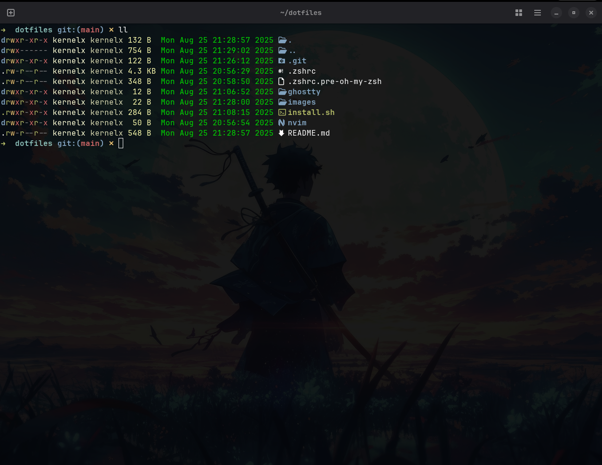
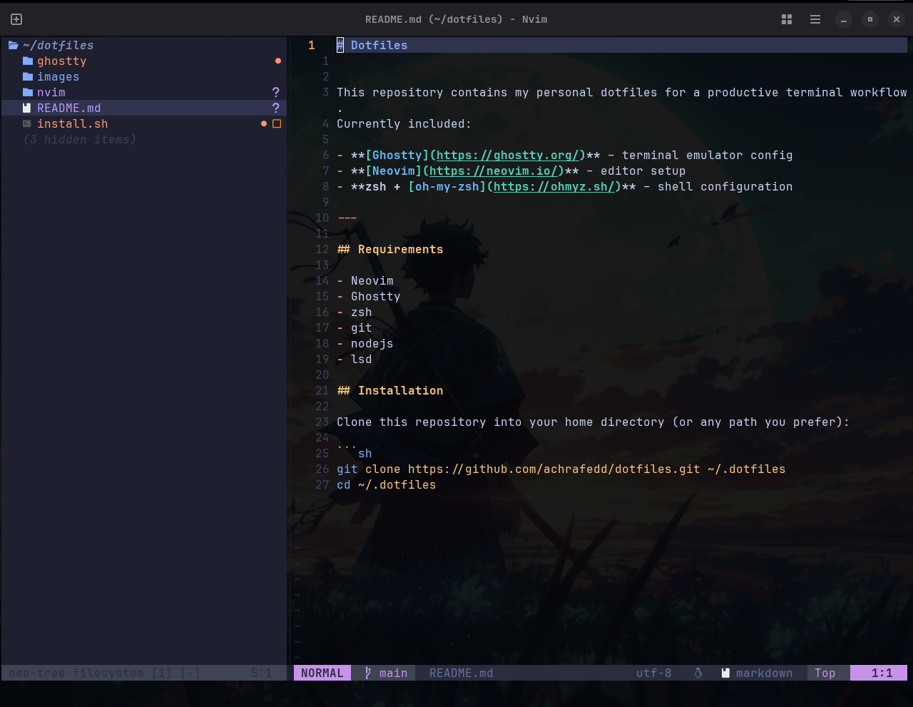

# Dotfiles




This repository contains my personal dotfiles for a productive terminal workflow.
Currently included:

- **[Ghostty](https://ghostty.org/)** – terminal emulator config
- **[Neovim](https://neovim.io/)** – editor setup
- **zsh + [oh-my-zsh](https://ohmyz.sh/)** – shell configuration

---

## Requirements

- Neovim >= 0.9.0 
- Ghostty
- zsh
- git
- nodejs
- gcc
- lsd for decorative ls
- Nerdfonts - to show icons (i use )

## Installation

Clone this repository into your home directory (or any path you prefer):

```sh
git clone https://github.com/achrafedd/dotfiles.git ~/.dotfiles
cd ~/.dotfiles
```

## Shell tools

- fzf - Interactive filtering
- lazygit - GUI git in terminal
- lsd - decorate ls


## ghostty shortcuts

- <CTR-r>: hot reload
- <CTR-R>: split right
- <CTR-D>: split down
- <CTR-H>: move left
- <CTR-J>: move down
- <CTR-K>: move up
- <CTR-L>: move right
